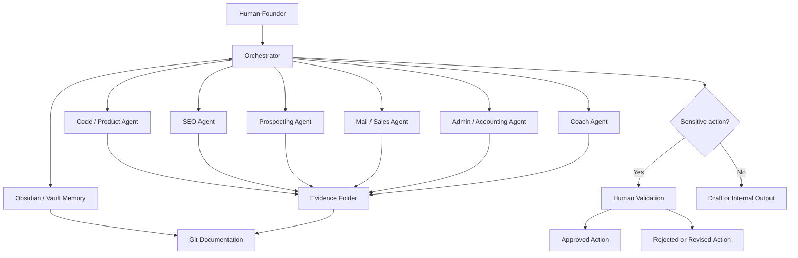

# Architecture

Founder OS should start as a simple, human-supervised system. The MVP architecture is an orchestrator coordinating specialized agents, a local vault for memory, Git for project documentation, and evidence folders for proof of work.

## Core Components

- **Orchestrator:** receives requests, breaks them into tasks, routes work to the right agent, checks permissions, asks for human validation, and records outcomes.
- **Agents:** handle scoped business functions such as product planning, SEO, prospecting, sales drafting, admin preparation, and founder coaching.
- **Obsidian / vault:** stores durable memory: decisions, client context, reusable templates, lessons learned, validated assumptions, and operating notes.
- **Evidence storage:** stores screenshots, run logs, review notes, and artifacts that prove what happened.
- **Human validation:** gates sensitive actions before anything external, financial, public, or permanent happens.

## Mermaid Diagram

## Orchestrator Responsibilities

The orchestrator is not an all-powerful agent. Its role is coordination:

- Interpret the founder's request.
- Identify which agent should work on each subtask.
- Check the permissions policy before action.
- Request human validation for sensitive actions.
- Ask agents for evidence when they produce outputs.
- Write or propose updates to memory only when appropriate.
- Keep the workflow small enough to inspect.

## Vault Responsibilities

The vault stores long-lived knowledge, not raw noise. It should contain:

- Validated business assumptions.
- Client and prospect context that is allowed to be stored.
- Offer templates and delivery checklists.
- Agent operating notes.
- Decisions made by the founder.
- Retrospectives and lessons learned.

The vault should not become a dumping ground for unverified scraped data, private personal data, or temporary drafts that have no future value.

## Evidence Storage

Evidence belongs in `evidence/`.

- `evidence/screenshots/` stores real screenshots.
- `evidence/runs/` stores real run logs, review notes, or execution summaries.

Evidence should answer: what was done, when it was done, what input was used, what output was produced, and what human validation occurred.

## Human Validation

Human validation is required before:

- Sending real emails.
- Contacting prospects.
- Publishing public content.
- Using paid APIs.
- Importing prospect data.
- Storing personal data.
- Changing pricing.
- Updating client deliverables.
- Pushing to a remote repository.

The system should make approvals explicit and record the evidence behind them.

## Platform Options

### Local

The vault, documentation, drafts, and low-risk experiments can run locally. This improves privacy and keeps the system understandable, but local models may be weaker and hardware-limited.

### Cloud

Cloud AI providers can handle stronger reasoning, document drafting, and complex planning. This improves productivity and reliability, but introduces cost, privacy, and external dependency concerns.

### Hybrid

The recommended MVP is hybrid: local vault and Git repository, cloud AI for high-value reasoning, and optional local models through Ollama for private drafts or experiments. This keeps the system practical without committing too early to a heavy platform.
